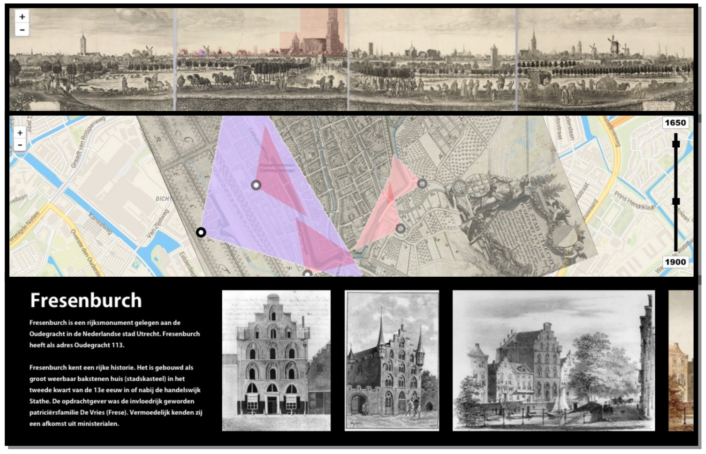

# Utrecht in Perspectief (voorheen Utrecht Skyline project)

## Concept afbeelding

## Aanleiding

[01 aug 2019 - Het Utrechts Archief - Ideeën gezocht voor nieuwe expositie 'Skyline van Utrecht’ in 2020](https://hetutrechtsarchief.nl/over-ons/nieuws/463-denk-met-ons-mee-over-de-nieuwe-expositie-denk-met-ons-mee-over-expositie-de-sky-line-van-utrecht-in-2020)

## Online demo

http://utrechtinperspectief.nl

## Expo

Vanaf 10 september 2020 is de (web)app te zien in de Expo van het Utrechts Archief als onderdeel van de expo 'Utrecht aan de Singel'.

