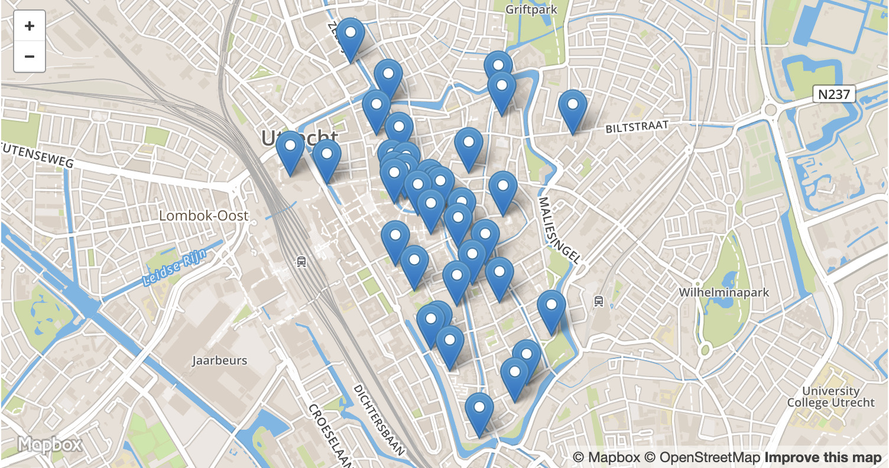

# Utrecht Skyline project

## Concept afbeelding

## Tips

### Afbeeldingen op Wikimedia Commons
Voor de beelden uit de '3e laag' met de afbeeldingen van objecten kunnen Wikimedia Commons gebruiken. Daar kun je via `?width=200px` de afbeelding in meerder formaten opvragen.
http://commons.wikimedia.org/wiki/Special:FilePath/18297-Pieterskerk.JPG?width=200px

### Wikidata query 
Query op 25 van de 36 bekende [data/Gebouwen.md] uit het Saftleven uit 1684. 
https://w.wiki/GaT

### geojsonlint.com
Via http://geojsonlint.com/ kun de GeoJSON valideren ([saftleven.geojson](data/GeoJSON/saftleven.geojson)) en ook visualiseren op een kaart. Github kan het ook zelf visualiseren: ([saftleven.geojson](data/GeoJSON/saftleven.geojson))

