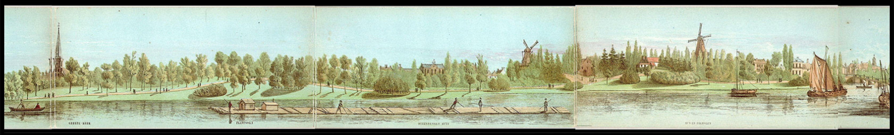
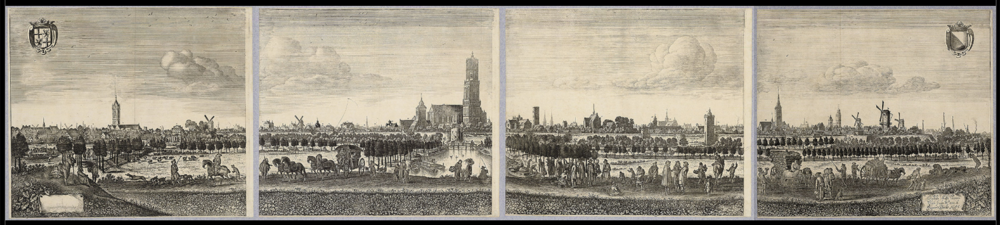
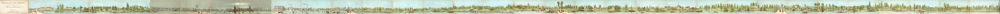

# Panorama's

## Saftleven (1669)
* HUA Catalogusnummer [27570](https://hetutrechtsarchief.nl/collectie/beeldmateriaal/catalogusnummer/27570)
* [Saftleven-1669-27570.jpg](Saftleven-1669-27570.jpg) (3.4 MB)

## Saftleven (1684)
* HUA Catalogusnummers [28386](https://hetutrechtsarchief.nl/collectie/beeldmateriaal/catalogusnummer/28386), [28387](https://hetutrechtsarchief.nl/collectie/beeldmateriaal/catalogusnummer/28387), [28388](https://hetutrechtsarchief.nl/collectie/beeldmateriaal/catalogusnummer/28388) en [28389](https://hetutrechtsarchief.nl/collectie/beeldmateriaal/catalogusnummer/28389)
* Op dit panorama staan 36 nummers die elk verwijzen naar een bouwwerk: [Gebouwen.md](https://github.com/hetutrechtsarchief/Utrecht-Skyline/blob/master/data/Gebouwen.md)
* [Saftleven-1684-28386-tm-28389.jpg](Saftleven-1684-28386-tm-28389.jpg) (61.9 MB)
* [Panorama view with Zoomify](https://hualab.nl/skyline/panoramas/Zoomify-Saftleven-1684/)

## J.Bos (1859)
* HUA Catalogusnummers 135001 t/m 135033
* [J.Bos-1859-13501-tm-135033.jpg](J.Bos-1859-13501-tm-135033.jpg) (65500 × 1000 pixels, 19.4 MB)
* [Panorama view with Zoomify](https://hualab.nl/skyline/panoramas/Zoomify-J.Bos-1859/)

